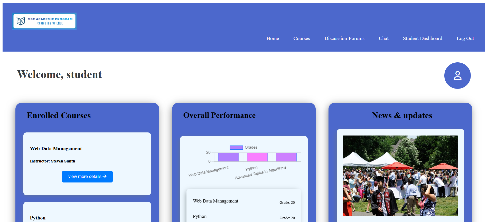
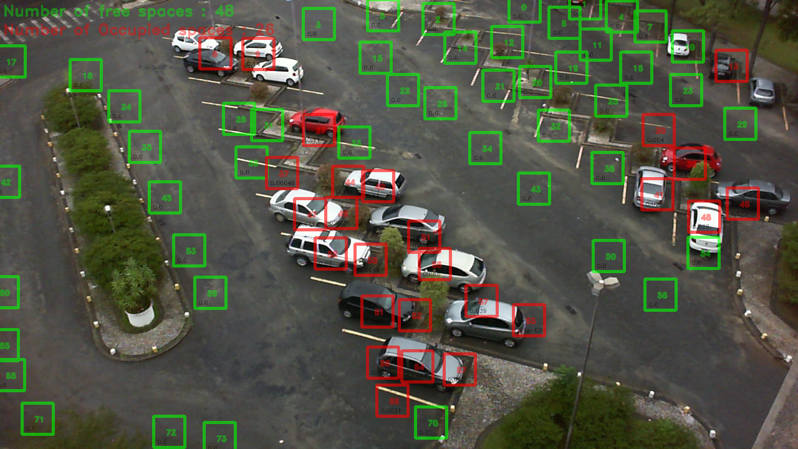
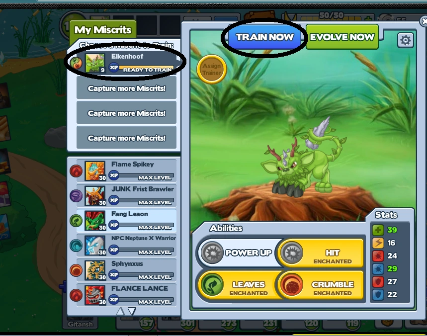



  

    
    <h3><strong>Learning Management System</strong></h3>
    
<strong>Technologies Used:</strong> React.js, CSS, Laravel (PHP), Git, MySQL, JWT

    
<a href="sxk3354.uta.cloud" target="_blank">View Project</a>

  

  

    
    <h3><strong>Personalized Career Recommendation Assistant</strong></h3>
    
<strong>Technologies Used:</strong> React.js, Cohere Gen AI, Chatscope UI Kit, React Hooks

    
<a href="https://sxk3354.uta.cloud/careers" target="_blank">View Project</a>

  

  

    
    <h3><strong>Parking Lot Occupancy Detection</strong></h3>
    
<strong>Technologies Used:</strong> Python, OpenCV, Hough Transform, YAML, Docker

    
<a href="https://github.com/t1ppu/Parking-lot-detection" target="_blank">View Project</a>

  

  

    
    <h3><strong>MapReduce on IMDB Dataset</strong></h3>
    
<strong>Technologies Used:</strong> Java, MapReduce, Apache Hadoop, HDFS

    
<a href="https://github.com/t1ppu/MapReduce-on-IMDB-dataset" target="_blank">View Project</a>

  

  

    
    <h3>Project 5: <strong>Auto-Miscrits</strong></h3>
    
<strong>Technologies Used:</strong> Python, Selenium, Web Scraping, Automation, Pyautogui, easyOCR 

    
<a href="https://github.com/t1ppu/auto-miscrits" target="_blank">View Project</a>

  

[View Full Resume](../files/Kolli_Resume.pdf)
